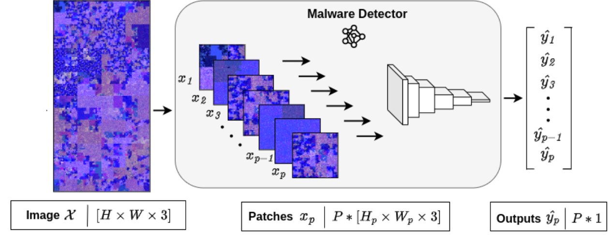

# Container Classification

### What this package is

The `container-classification` package provides training, evaluation, inference, 
and explainability tooling for patch-based vision models that classify software
container images as benign or malevolent. The package uses the COSOCO image
dataset, provided in multiple formats including `json` lists and WebDataset shards.

`container-classification` is a patch-based vision pipeline for detecting
malware-compromised software containers from image representations. It provides
ready-to-run scripts to train models, evaluate checkpoints, run inference on
new container images, and generate Grad-CAM explanations.



### What it does

- Loads RGB images representing software containers.
- Splits each image into fixed-size patches and assigns patch labels.
- Trains CNN backbones for binary classification (benign vs malevolent).
- Evaluates models with patch-level and image-level aggregation.
- Runs inference and returns a single image-level verdict and probability.
- Produces patch-level Grad-CAM visualizations for supported models.

### External references
- [Dataset](https://huggingface.co/datasets/k3ylabs/cosoco-image-dataset)
- [Dataset Documentation](https://huggingface.co/datasets/k3ylabs/cosoco-image-dataset/blob/main/docs/COSOCO-dataset-readme-v1_0.pdf)
- [Paper](https://arxiv.org/abs/2504.03238)


## Quick start

Install (from `packages/container-classification`):

```bash
pip install -e .
```

Choose a configuration file and update paths:

- `cfgs/train_json_cfg.toml`
- `cfgs/train_webd_cfg.toml`
- `cfgs/evaluate_json_cfg.toml`
- `cfgs/evaluate_webd_cfg.toml`
- `cfgs/explain_cfg.toml`

Train:

```bash
p2code-container-classifier-train --cfg_path cfgs/train_webd_cfg.toml
```

Evaluate a checkpoint:

```bash
p2code-container-classifier-evaluate --cfg_path cfgs/evaluate_json_cfg.toml
```

Run inference on a single image:

```bash
p2code-container-classifier-infer --model_path /path/to/model.pth --model_type resnet18 --image_path /path/to/image.png
```

Or alternatively use directly the scripts inside the `container-classification/src/bin` folder: the console entry points:
- `bin.train`
- `bin.evaluate`
- `bin.infer`


## Configuration overview

All scripts use TOML configs. The key sections are:

- `device`: `cpu`, `cuda`, or `xpu`.
- `use_wandb`: enable or disable Weights & Biases logging.
- `dataset.format`: `json`, `dir`, `webdataset`, or `webdataset-multi`.
- `dataset.path`: base directory for images or shards.
- `dataset.json` or `dataset.dir`: split paths.
- `dataset.kw`: `task`, `patch_size`, `weights`.
- `dataset.dataloader.*` or `dataset.webloader.*`: batch size and workers.
- `train`: model type, epochs, optimizer settings.
- `model`: checkpoint metadata for evaluation.
- `out`: output directories for models and CSV results.

See the example configs in `cfgs/` for complete templates.


## Assumptions and conventions

- Labels are binary: `benign` (0) and `malevolent` (1).
- JSON records must include `name` and `label`.
- Directory loading assumes a layout like `data/benign/*.png` and
  `data/malevolent/*.png`.
- WebDataset samples must include `png`, `mask.png`, and `json` entries.
- Patch extraction uses a fixed `patch_size` with non-overlapping patches.
- Training and evaluation are patch-based; image-level results are aggregated
  from patch predictions.
- Inference returns a single image-level class and probability.


## Results and reporting

Evaluation writes a CSV file with the following columns:

```
image_name,y_true,y_pred,malevolent_prob
```

Where:

`image_name`: The input image name.
`y_true`: Image-level true labels.
`y_pred`: Image-level predicted labels.
`malevolent_prob`: The probability for the image containing a malware taken 
as the maximum predicted probability across image patches.   

Patch predictions are aggregated per image using:
- Image label: max patch label.
- Image probability: max malevolent patch probability if any patch is malevolent,
  otherwise the mean of patch probabilities.


## Additional documentation

- Data layout and loading: `docs/data-layout-and-data-loading.md`
- Patch extraction: `docs/patch-extraction.md`
- Training and evaluation: `docs/training-and-evaluation.md`
- Inference: `docs/inference.md`